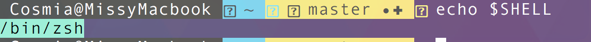
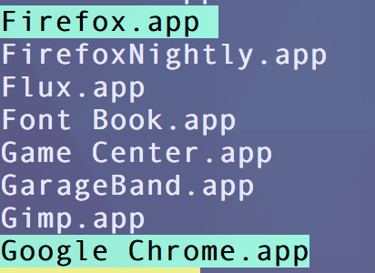

# How to Search Popular Developer Resources from the Command Line (Mac OS X)

- **GOAL:** easily execute searches of common developer resources such as [Stack Overflow](http://stackoverflow.com), [MDN](https://developer.mozilla.org), [Codrops CSS Reference](http://tympanus.net/codrops/css_reference/), and [Can I Use](http://caniuse.com) from the command line  
- **KNOWLEDGE REQUIRED:** basic command line usage and a general understanding of how functions work  
- **DIFFICULTY:** easy

As you find yourself spending more time with your terminal open, you might also start to wonder what else you can do from the command line to streamline your workflow. 

One thing I find annoying is constantly going to sites like [Can I Use](http://caniuse.com) and [MDN](https://developer.mozilla.org). When I am working on a project, I lose track of how many times I check MDN throughout the day. While it's not *that* time consuming to start to type the address in my browser and have my bookmark for it pop up, then search for whatever I'm looking for, I knew there had to be a better way.

Earlier this year, I started using the free version of [Alfred](https://www.alfredapp.com/). One of the features I find most useful is **web search**. I immediately set up a few, one of them being good old MDN. It works something like this:

- set up a search shortcut with a nickname (**mdn**, in this case) and the URL to make a query on whatever site you wish
- when opening the Alfred prompt (<kbd>CMD</kbd> + <kbd>SPACE</kbd> by default), follow the nickname with your query term; hit enter

<figure>
  
  <figcaption><i>A new tab with my search result opens without ever even touching my browser</i>
  </figcaption>
</figure>
<br>
Honestly, it might as well have been magic when I first discovered this. I use it all the time and it really does save me a lot of time and needless typing. 

Recently I started to wonder if there was a way to accomplish the same thing, but without needing yet another app. While Alfred has a lot of uses beyond this, most are not available to free users. 

Being I have my terminal open at almost all times anyway, I decided to recreate the wonders of Alred's web search shortcuts from the command line. 

It's quick and easy, and you only need a very basic understanding of how to write a function in order to follow along.

## Open Your Shell Configuration File

We're going to need to make some edits to our shell configuration file no matter where we end up writing our functions.

If you're unsure what shell you're running, run the following command:

```bash
echo $SHELL
```

<figure>
  
  <figcaption><i>/bin/zsh shell is returned to me, telling me I am running zshell</i>
  </figcaption>
</figure>
<br>
**If you're running bash:** your configuration file is most likely **~/.bashrc**. Open it by running:

```bash
open ~/.bashrc
```

**If you're running zshell:** your configuration file is most likely **~/.zshrc**. Open it by running:

```bash
open ~/.zshrc
```

## Create a Function File (Optional)

This is not *required*, though it helps keep things organized. You could just add the functions somewhere within your **.bashrc** (or **.zshrc** if using zhsell) configuration file, but creating a new file just for these functions allows us to keep our main script file lean, as well as allow us to easily locate, add, or remove functions.

Open your text editor of choice and create a new file. It doesn't matter what you name it or where you save it. To be extra organized, you might want to create a special folder to store any files you create and want to load when your shell starts.

I'm just going to create a file in my home directory and name it **devsearch_functions**. 

At the top of your function file, add the following:

`#!/usr/bin/env bash`

This lets the shell know that our file is a script and to try to execute it using `bash`. If you're using a different shell, you can change `bash` to whatever shell you're using. However, I use **zshell** and still use the above line in all of my scripts with no problem.

## (If You Created a Function File): Add Your Function File to Your Configuration File

Before we write our functions, let's make sure our configuration file has a way to load our function file. 

**You only need to do this if you created a separate file for storing your functions.** If you're adding your functions to your main configuration file, skip this step.

Go to your **configuration file**, which you already have open (Right? *Right?*). Let's find a way to tell the shell to load and execute our function file when our configuration file is loaded.

I'm going to do this using an `if` statement which will first check to see if the function file exists before trying to execute it. 

You can put this anywhere in your configuration file. Put it where it makes the most sense to you.

```bash
# if function file exists, load it
if [ -f /path/to/functions ]; then
  . /path/to/functions
fi
``` 

Since I named my file **devsearch_functions** and saved it in my home directory, my `if` statement will look like this:

```bash
if [ -f ~/devsearch_functions ]; then
  . ~/devsearch_functions
fi
```

## Write Those Functions

Now, we're finally ready to write our functions. I'm going to start off with one example and go step-by-step. With the other functions, I'll include the code, but skip the steps since they will be the same.

**In this example, I'll be creating a function for searching the Codrops CSS Reference.**

1. In your function file (or somewhere in your configuration file), declare your function. I'm going to simply call this one **css**. The name of your function will be what you use to execute / call it from the command line, so pick something that makes sense but is also quick to type repeatedly.

  ```bash
  function css() {
   
  }
  ```
  
2. We need to find out how to make a query on the CSS Reference. To do this, let's go to the [Codrops](http://tympanus.net/codrops) and make any search using the search function:

  
  
  What we're looking for is the URL returned from the query:
  
  
  
  We can see our search term, which was **borders**. We know now where our query term needs to go when we execute our search.
  
  At the end of the URL, you'll notice **type=posts**. We don't want to search Codrops posts; we want to search the CSS Reference. So in our URL we'll build up, we'll want to replace **posts** with **css_reference**.
  
3. Now that we know how to search the CSS Reference, let's build up our query URL in our function:

  
  ```bash
  function css() {
   # store our URL in a variable
   QUERY="http://tympanus.net/codrops/css_reference/"
  }
  ```
  
  To start with, we'll have our URL go to the main CSS Reference site. That way if we do not provide a search term when calling our function, the default action will be to take us to the CSS Reference's main page, so the function is usable with or without a search term.
  
4. Now we can check to see if a search term (in our case, a parameter) has been provided when the function is called.

  We'll do this with an `if` statement. 
  
  ```bash
  if [ -n "$1" ]; then
      #do something
  fi
  ```
  The `-n` option means "not null". If we call our function with a search term, that term will be positional parameter `$1`. So the above `if` statement checks positional parameter `$1`. If we've used a search term, it will be *not null*, and our `#do something` code will execute.
  
  
 Our function now looks like this:
  
 ```bash
 function css() {
    # default search page if no search term is provided
    QUERY="http://tympanus.net/codrops/css_reference/"
    if [ -n "$1" ]; then
      # do something
    fi
}
```

5. If we have provided a search term when calling out function, we'll need to change the URL to include our query. 

  If you remember from step 2, our query URL should look something like this:
  
  **http://tympanus.net/codrops/?s=SEARCHTERM&search-type=css_reference**

  We'll need to plug in our search term (which is positional parameter `$1`) and reassign the new URL to our `QUERY` variable:
  
  ```bash
  if [ -n "$1" ]; then
      QUERY="http://tympanus.net/codrops/?s=$1&search-type=css_reference"
  fi
  ```
  
  As you can see, a reference to our parameter is used where normally you would see a search term.
  
  Our function now looks like this:
  
  ```bash
  function css() {
    # default search page if no search term is provided
    QUERY="http://tympanus.net/codrops/css_reference/"
    if [ -n "$1" ]; then
      QUERY="http://tympanus.net/codrops/?s=$1&search-type=css_reference"
    fi
  }
  ```
  
6. Our last step is to actually open a browser tab with our query URL. 

  This will be different depending on what browser you use.
  
  We'll need to:
  
  - use the `open` command
  - use the `-a` option to let it be known that the string that follows is the executable path to the application that should be used
  - specify an executable path to the application (in our case, the browser) to use
  - tell the application what to open (in our case, this will be our query URL)

  The steps will be the same no matter what browser you use; the only difference will be the path to the application.
  
  In most cases, the path to execute the three main OS X browsers will be:
  
  - **Firefox:** `/Applications/Firefox.app`
  - **Chrome:** `/Applications/Google Chrome.app` (*don't forget to escape the space with `\`*)
  - **Safari:** `/Applications/Safari.app`

  If you want to be sure, run the following command:
  
  ```bash
  ls /Applications
  ```
  
  You'll see a list of all of your applications with the application name following by the **.app** extension:
  
  
  
  For my functions, I'm going to use the **Chrome** browser to open all of my searches, but feel free to use whichever browser you like. 
  
  The final line of our function will look something like this:
  
  ```bash
   `open -a /Applications/Google\ Chrome.app $QUERY`
  ```
  
  We're using the back-ticks (<kbd>`</kbd>) to execute the command when the function is done running. In our case, this line in our script will take our query URL and open it in a new Chrome tab (*or open Chrome and display it in a new window if the browser is not already open*) whenever we run our function.
  
  Our final function should look like this:
  
  ```bash
  function css() {
    # default search page if no search term is provided
    QUERY="http://tympanus.net/codrops/css_reference/"
    if [ -n "$1" ]; then
      QUERY="http://tympanus.net/codrops/?s=$1&search-type=css_reference"
    fi
    `open -a /Applications/Google\ Chrome.app $QUERY`
  }
  ```
  
## Make a Search

Now that we've written our first function, let's take this for a test drive to make sure everything is working.

Save your configuration file. If you wrote your file in a function file, save your function file. 

Once your files are saved, you'll have to restart your terminal so your new function can be loaded. Exit and reopen your terminal. (*If using iTerm, you can just go to Shell > Restart Session from the top menu.*)

Now your shell will load with your new function. We're ready to make a search!

Our search is done with the following format: **function-name "search-term"**. 

(*It's always best to wrap your search term in quotes to prevent parameter expansion, especially since we're only using one parameter in our script.*)

I'm going to search for **border-image** in the CSS Reference. All I have to do is type the following command and hit <kbd>ENTER</kbd>:

```bash
css "border-image"  
```

Watch the magic unfold (*and yes, I broke my "wrap your search term in quotes" rule*):


It worked! And the search took barely any effort. I didn't have to touch the browser at all. My browser didn't even have to be open at the time in order for me to make the search. I didn't have to navigate the page to find the search field. I didn't have to sort through a list of results in my bookmarks to find the page I wanted to search. 

## The Rest of the Functions

I mentioned at the beginning that the goal was to be able to search MDN, Can I Use, Stack Overflow, and the Codrops CSS Reference, but I only wrote one function. The rest can be found below. Note that the only difference is the query URL.

With sites like MDN and Stack Overflow where your search term will almost certainly be more than one word, *remember to wrap the term in quotes*.

### Stack Overflow

For the same of brevity, I named my Stack Overflow function **so**, but you might prefer something with more clarity.

```bash
# Stack Overflow
# example execution: so "vertically center multiple lines of text"
function so() {
  # default search page if no search term is provided
  QUERY="http://stackoverflow.com/search?q="
  if [ -n "$1" ]; then
    QUERY="http://stackoverflow.com/search?q=$1"
  fi
  `open -a /Applications/Google\ Chrome.app $QUERY`
}
```

**In action:**


### MDN (Mozilla Developer Network)

```bash
# Mozilla Developer Network
# example execution: mdn "operator precedence"
function mdn() {
  QUERY="https://developer.mozilla.org/en-US/search?q="
  if [ -n "$1" ]; then
    QUERY="$QUERY$1"
  fi
  `open -a /Applications/Google\ Chrome.app $QUERY`
}
```

**In action:**


### Can I Use

```bash
# Can I Use
# example execution: cani flexbox
function cani() {
  QUERY="http://caniuse.com/#search="
  if [ -n "$1" ]; then
    QUERY="$QUERY$1"
  fi
  `open -a /Applications/Google\ Chrome.app $QUERY`
}
```

**In action:**


---

You can do this for any site that is searchable, but I just wanted to share a few of the sites I search most often to get you started. 
